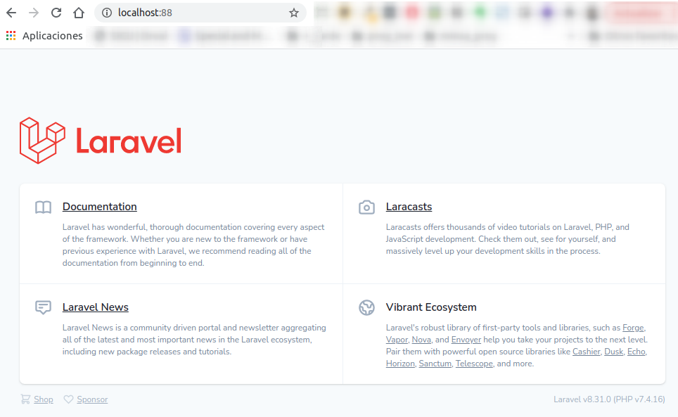
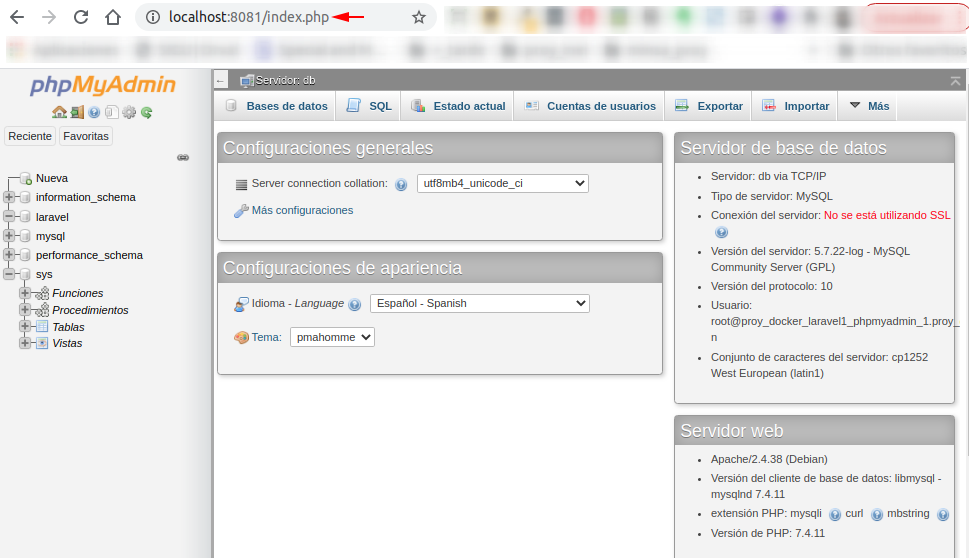

# Proyecto Docker con laravel, Nginx, mysql, y phpMyadmin

- Proyecto basado en:
    https://www.digitalocean.com/community/tutorials/como-configurar-laravel-nginx-y-mysql-con-docker-compose-es

- Diseñado bajo ubuntu 18.04  

- Dar permisos totales a la carpeta
    ```
    $ sudo chmod -R 777 proy_docker_laravel2
    ```
- Instalar el composer
    ```
    $ cd laravel-app/
    $ docker run --rm -v $(pwd):/app composer install
    ```
- Levantar el docker con el comando:
    ```
    $ docker-compose up -d
    ```
- Una vez finalizada la instalacion del docker se mostrara:   
   ```
   ...
    Creating laravel-app       ... done
    Creating laravel-db        ... done
    Creating laravel-webserver ... done
    Creating laravel-myadmin   ... done
   ```
- Luego correr el comando:
    ```
    $ docker-compose exec app php artisan key:generate
    ```
    Muestra:
    - Application key set successfully
- Luego correr el comando:
    ```
    $ docker-compose exec app php artisan config:cache
    ```
    Muestra:
    - Configuration cache cleared!
    - Configuration cached successfully!
- Consultar el **app laravel** en el navegador web:
   ```
   http://localhost:8080/
   ```
    
- Consultar el **PHPMyadmin** en el navegador web:
   ```
   http://localhost:8081/
   ```
    

# Notas programador
1) Crear el usuario "laraveluser" del .env del laravel en la BD y dar permisos de de alcance a la BD "laravel"

2) Ejecutar el comando de migraciones iniciales:
    ```
    $ docker-compose exec app php artisan migrate
    ```
3) Crear un modelo **Empleado**
    ```
    $ docker-compose exec app php artisan make:model Empleados -mcr
    ```
    * La opcion **-mcr** => (Crear archivo models, controller, resource)

    Resultado:
    ```
    Model created successfully.
    Created Migration: 2021_03_10_225436_create_empleados_table
    Controller created successfully.
    ```
