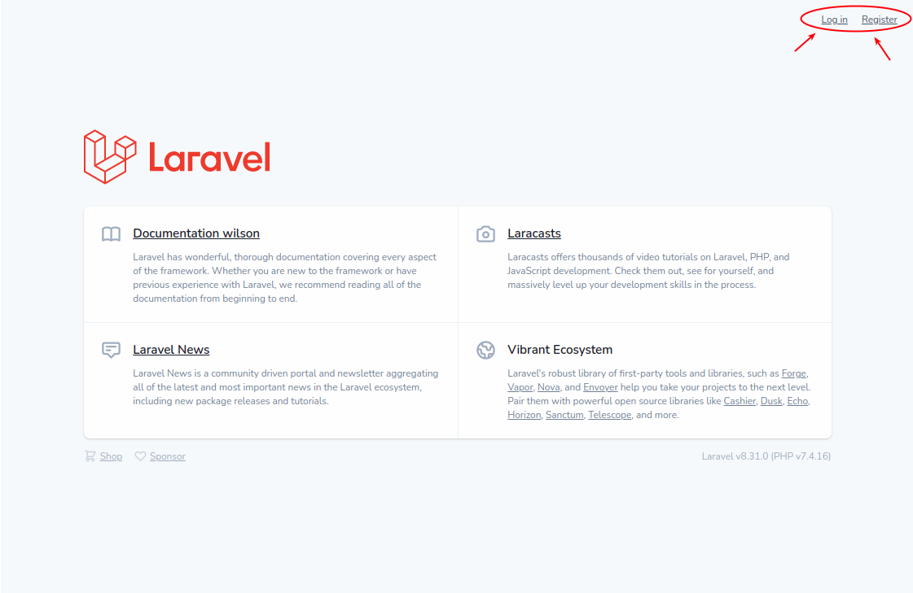

# Realizacion de un CRUD - laravel
 - Para realizar un crud se ha realizado basado en el tutorial:
        ```
        https://youtu.be/6KX4r03FrR0
        ```

## Pasos
1) Crear el modelo con el comando:
  ```sh
  docker-compose exec app php artisan make:model Empleado -mcr
  ```
2) Modificar el archivo migration creado en la carpeta database:

  **/laravel-app/database/migrations/** 2021_03_11_005758_create_empleados_table.php
  ```sh
  Agregar los campos (Nombre, apellidos, correo, foto):
    $table->id();
    ... 
    $table->string('Nombre');
    $table->string('ApellidoPaterno');
    $table->string('ApellidoMaterno');
    $table->string('Correo');
    $table->string('Foto');
    ...
  ```
3) correr el comando:;
    ```sh
    $ docker-compose exec app php artisan migrate
    ```
    Resultado:
    - Migrating: 2021_03_11_005758_create_empleados_table
    - Migrated:  2021_03_11_005758_create_empleados_table (55.48ms)

4) mostrar las rutas con el php artisan
    ```sh
    $ docker-compose exec app php artisan route:list
    ```
5) Generar enlace del storage
    ```sh
    $ docker-compose exec app php artisan storage:link
    ```
# Integrando el modulo de Autenticacion
  Basado en el link https://dev.to/kingsconsult/laravel-8-auth-registration-and-login-32jl

1) Instalando paquete **Jetstream**
    ```sh
    $ docker-compose exec app composer require laravel/jetstream
    ```
2) Instalando paquete **livewire**
    ```sh
    $ docker-compose exec app php artisan jetstream:install livewire
    ```
3) Instalando paquete **livewire**
    ```sh
    $ docker-compose exec app php artisan migrate
    ```

## Instalar NODEJs en el server
4) Lo instale siguiendo la guia: https://www.freecodecamp.org/news/how-to-install-node-js-on-ubuntu-and-update-npm-to-the-latest-version/
    ```sh
    $ docker-compose exec app bash
    ```

5) Instalando dentro del docker **NodeJs**
    ```sh
    $ docker-compose exec app npm run development
    $ sudo apt install build-essential
    ```
    LINK: https://www.digitalocean.com/community/tutorials/how-to-install-node-js-on-ubuntu-18-04

4) Luego de instalar NodeJs y Mvn, verificar la version instalada:
    ```sh
    $ docker-compose exec app npm -v
    $ docker-compose exec app nodejs -v
    ```
    Actualmente estoy en la version Node=>12.21  || npm=>6.14

5) Ingresar a la carpeta **laravel-app**
    ```sh
    $ cd laravel-app
    ```
6) Realizar la instalacion del paquete **npm develop**
    ```sh
    $ docker-compose exec app npm run development
    ```
    Finalmente muestra:
    ```
     Laravel Mix v6.0.13   
     ✔ Compiled Successfully in 12251ms
    ``` 
7) consultar nuevamente en la web y se mostrara el **login** y **register**: 
   ```
   http://localhost:8080/
   ```
    
    